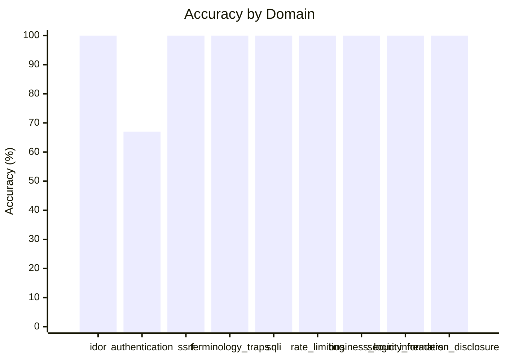

### Accuracy by Domain

```mermaid
xychart-beta
    title "Accuracy by Domain"
    x-axis ["idor", "authentication", "ssrf", "terminology_traps", "sqli", "rate_limiting", "business_logic", "security_headers", "information_disclosure"]
    y-axis "Accuracy (%)" 0 --> 100
    bar [100, 67, 100, 100, 100, 100, 100, 100, 100]
```
